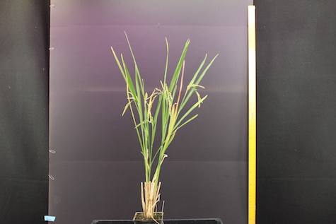
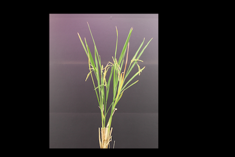
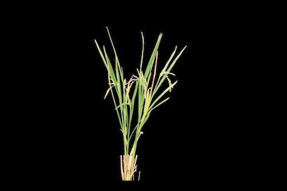
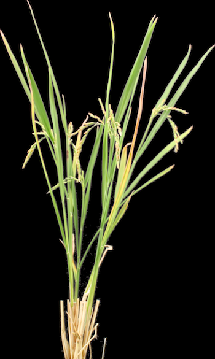

Camera Processing Example #2
=============================
This section will detail a shorter script that provides details on how to process
an image manually taken with a camera.

Python Script
-----------------------
:download:`Download Script <../../examples/scripts/camera2/camera2.txt>`

:download:`Download Image <../../examples/scripts/camera2/IMG_0370.JPG>`

.. code-block:: python

  import ih.imgproc

  plant = ih.imgproc.Image("/path/to/your/image")

  plant.crop([280, "y - 175", 1000, 3200])
  plant.write("crop.png")

  plant.colorFilter("((g - b) > 0)")
  plant.write("thresh.png")

  plant.contourChop(plant.image, 1000)
  plant.write("chop.png")

  plant.contourCut(plant.image, resize = True)
  plant.write("final.png")

This script has only four processing steps but produces a very good result.  Let's
look at each block

.. code-block:: python

	import ih.imgproc
	plant = ih.imgproc.Image("/path/to/your/image")

These two lines setup your image.  The first line imports the ih image processing
module, the second loads our image.  Here's what our base image looks like:

|

.. code-block:: python

  plant.crop([280, "y - 175", 1000, 3200])
  plant.write("crop.png")

First, we :py:meth:`~ih.imgproc.Image.crop` the image to remove some background
noise.  All ROI's are of the form [ystart, yend, xstart, xend], so in this case
we are removing a small amount from the top and bottom of the image, and a lot
from each side.  We then write the image:

|

.. code-block:: python

  plant.colorFilter("((g - b) > 0)")
  plant.write("thresh.png")

Next, we apply a :py:meth:`~ih.imgproc.Image.colorFilter` to the image, with the
logic "g - b > 0".  This means that we only keep pixels in the image whose green
channel is greater than the value of the blue channel.  We then write the image:

|

.. code-block:: python

  plant.contourChop(plant.image, 1000)
  plant.write("chop.png")

We then use the :py:meth:`~ih.imgproc.Image.contourChop` function to remove
small contours from the image.  This takes advantage of the fact that the
plant is completely connected, and the noise around it isn't.  We then write
the image:

|

.. code-block:: python

  plant.contourCut(plant.image, resize = True)
  plant.write("final.png")

Finally, we use the :py:meth:`~ih.imgproc.Image.contourCut` function to
crop the image to just the plant, and write our final result:

Command Line Script
-------------------
:download:`Download Script <../../examples/scripts/camera2/camera2.sh>`

:download:`Download Image <../../examples/scripts/camera2/IMG_0370.JPG>` (The image is identical to the one above)

.. code-block:: bash

  #!/bin/bash

  ih-crop --input /path/to/your/image --output crop.png --ystart 280 --yend "y - 175" --xstart 1000 --xend 3200
  ih-color-filter --input crop.png --output thresh.png --logic "((g - b) > 0)"
  ih-contour-chop --input thresh.png --output chop.png --binary thresh.png --basemin 1000
  ih-contour-cut --input chop.png --binary chop.png --output final.png --resize

This bash script performs the exact same workflow as the one above.  Although not major, it is important to note the
differences between library and command line access.  Command line access loads and writes an image at each step,
whereas library access loads once, and only writes when you tell it to.  Additionally, script names are close to that
of the method, and all follow lower case format, with words separated by dashes, and ih pre-pendening all commands.
The most notable difference, is that a restore method is unnecessary with command-line input.  We simply reuse the gray.png
file we wrote once.  Additionally, there is no initial setup, you simply begin processing.  The arguments passed into the
command line arguments match identically with the method arguments above.
