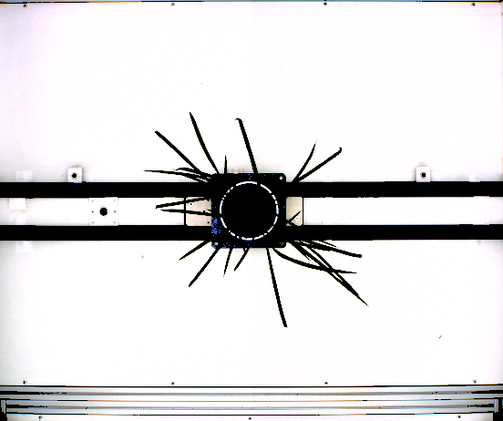
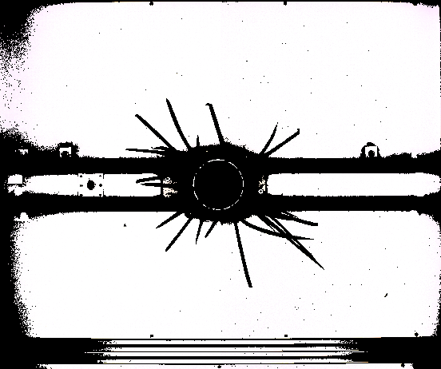
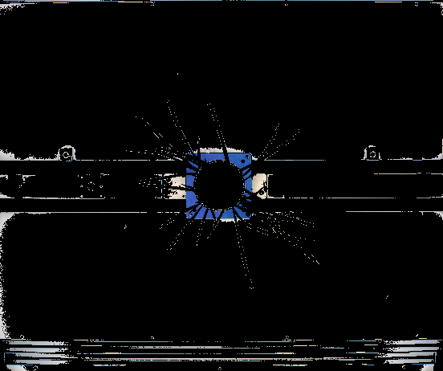
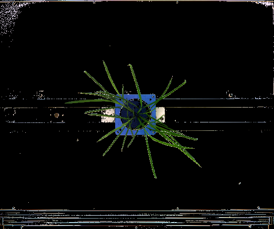
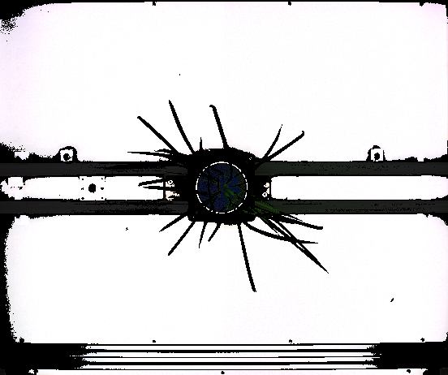
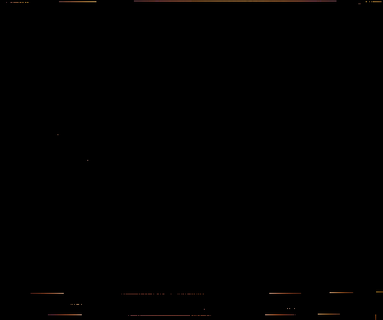
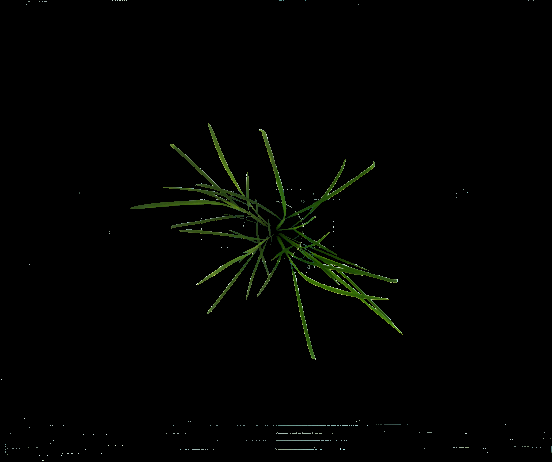

.. |br| raw:: html

	 

Color Filter In Depth #1
========================

The :py:meth:`~ih.imgproc.Image.colorFilter` function is a very powerful and versatile function, that removes pixels
from an image based on arbitrarily inputted logic.  This example
focuses solely on the uses and syntax of the :py:meth:`~ih.imgproc.Image.colorFilter` function.  This function takes
2 arguments.  The first is the actual logic to solve, and this first argument will be the main focus of all
color filter examples.  The second argument is simply a region of interest -- namely where you want
to apply your specified logic.  If left blank, it simply applies it to the entire image.  Let's talk
about what we can do with logic.  As stated under the function specific documentation, the supported
characters for logic are: '+', '-', '*', '/', '>', '>=','==', '<', '<=', 'and', 'or', 'max', 'min', '(', ')', 'r', 'g', 'b', as well
as any number.
Excluding parenthesis, these can be broken down into 2 categories, operators and values.  The operators
are all the symbols before the parenthesis: '+', '-', '*', '/', '>', '>=','==', '<', '<=', 'and', 'or', 'max', and 'min'.
The values are all the symbols after the parenthesis: 'r', 'g', 'b', and again, any number.
Parenthesis are used to make sure your logic is well formed and easy to parse.  Well formed logic means that each operator only acts
on 2 values, and logic is surrounded by parenthesis.  Thus ((r + g) + b) is well formed, but (r + g + b) is not.  The logic argument for this function
**must be well formed**.  This is important to remember as we continue forward.  Since we have fewer values than
operators, let's talk about values first.

Values are simply numbers.  Numbers that are input as raw text are interpreted literally -- this is a dense way
of saying that if a given number, say '15', occurs in your logic string, it is translated to the number 15.  However,
the other values hold special meaning relating to the colors of the image in question.  'r' is the value of the
red channel, 'g' is the value of the green channel, 'b' is the value of the blue channel.  If we are considering a particular pixel
of an image, and let's say it has the following values for its channels in BGR order: [20, 30, 40].  For this pixel, 'r'
equates to 40, 'g' equates to 30, and 'b' equates to 20.  We apply operators
to these values to remove pixels.

By applying operators, we look to convert our values into a true or false output.  The arithmetic operators
('+', '-', '*', '/') do exactly what you'd expect to numbers.  Thus, by themselves they do not return a true or false value.
The comparison operators ('>', '>=', '==', '<', '<=') however, return true or false depending on what their comparison
returns.  'max' and 'min' are used to select the maximum or minimum respectively of values.  Thus (b max g) selects the
maximum value between the blue and green channels.  ((b min g) min r) selects the minimum of all three channels.
Finally, 'and' and 'or' can be used to join together multiple pieces of logic.  That's a lot of text to absorb -- let's look at some examples.

Python Script
-------------

:download:`Download Script <../../examples/scripts/color1/color1.txt>`

:download:`Download Image <../images/sample/rgbtv1.png>`

.. code-block:: python

	import ih.imgproc

	plant = ih.imgproc.Image("/path/to/your/image")
	plant.save("base")

	logicList = [
		"(((r + g) + b) > 350)",
		"(r >= 250)",
		"((b > 150) and (b < 220))",
		"((((b max g) max r) - ((b min g) min r)) > 20)",
		"((((r + g) + b) > 700) or (((r + g) + b) < 100))",
		"((r - g) > 50)",
		"(((g - r) > 15) and (b < g))"
	]

	for logic in logicList:
	        plant.restore("base")
	        plant.show("base")
	        plant.colorFilter(logic)
	        plant.show(logic)
	        plant.wait()

This script applies different logic to the same image, while displaying both the base image
and the filtered image at the same time.  Let's talk about each individual piece of logic.  First is "(((r + g) + b) > 350)".  This
will sum up the value of each channel (the intensity of the pixel) and compare this sum to 350.  If the value is greater
than 350, it will keep the pixel, otherwise it writes it as black.  Here's the result:

.. image:: ../images/sample/rgbtv1_small.png
	:align: left

|
|
|
|
|
|
|
|
|
|
|
|
|
|
|
|
|
|
|
|
|
|
|

Next is "(r >= 250)".  This simply keeps any pixel who has a red value greater than or equal
to 250.  Color channels range from 0 to 255, so 250 is very large.  Here's the result:

.. image:: ../images/sample/rgbtv1_small.png
	:align: left

|
|
|
|
|
|
|
|
|
|
|
|
|
|
|
|
|
|
|
|
|
|
|

Next is "((b > 150) and (b < 220))".  This will keep any pixel that has a blue value
that is greater than 150 and less than 220.  Here's the result:

.. image:: ../images/sample/rgbtv1_small.png
	:align: left

|
|
|
|
|
|
|
|
|
|
|
|
|
|
|
|
|
|
|
|
|
|
|

Next is ""((((b max g) max r) - ((b min g) min r)) > 20)",".  This will keep any pixel
whose maximum channel value is at least 20 greater than its minimum channel value.  Here's the result:

.. image:: ../images/sample/rgbtv1_small.png
	:align: left

|
|
|
|
|
|
|
|
|
|
|
|
|
|
|
|
|
|
|
|
|
|
|

Next is "((((r + g) + b) > 700) or (((r + g) + b) < 100))".  This will keep any pixel whose
intensity is larger than 700 OR smaller than 100.  Here's the result:

.. image:: ../images/sample/rgbtv1_small.png
	:align: left

|
|
|
|
|
|
|
|
|
|
|
|
|
|
|
|
|
|
|
|
|
|
|

Next is "((r - g) > 50)".  This will keep any pixel that has a red channel value
that is at least 50 greater than its green channel value.  Here's the result:

.. image:: ../images/sample/rgbtv1_small.png
	:align: left

|
|
|
|
|
|
|
|
|
|
|
|
|
|
|
|
|
|
|
|
|
|
|

Finally, is "(((g - r) > 15) and (b < g))".  This will keep any pixel that has a green channel value at least 15
greater than the red channel value AND a blue channel value less than its green channel value.  Here's the result:

.. image:: ../images/sample/rgbtv1_small.png
	:align: left

|
|
|
|
|
|
|
|
|
|
|
|
|
|
|
|
|
|
|
|
|
|
|

Command Line Script
-------------------
:download:`Download Script <../../examples/scripts/color1/color1.sh>`

:download:`Download Image <../images/sample/rgbtv1.png>` (The image is identical to the one above)

.. code-block:: bash

	#!/bin/bash

	ih-color-filter --input "/path/to/your/image" --output "logic0.png" --logic "(((r + g) + b) > 350)"
	ih-color-filter --input "/path/to/your/image" --output "logic1.png" --logic "(r >= 250)"
	ih-color-filter --input "/path/to/your/image" --output "logic2.png" --logic "((b > 150) and (b < 220))"
	ih-color-filter --input "/path/to/your/image" --output "logic3.png" --logic "((((b max g) max r) - ((b min g) min r)) > 20)"
	ih-color-filter --input "/path/to/your/image" --output "logic4.png" --logic "((((r + g) + b) > 700) or (((r + g) + b) < 100))"
	ih-color-filter --input "/path/to/your/image" --output "logic5.png" --logic "((r - g) > 50)"
	ih-color-filter --input "/path/to/your/image" --output "logic6.png" --logic "(((g - r) > 15) and (b < g))"

This bash script performs the exact same color filtering as the above python script.  Each color filter call
must be done separately.  Each takes in the same input file, and writes a separate output file.
