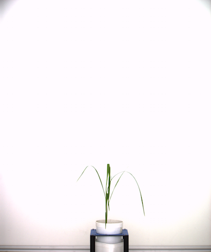
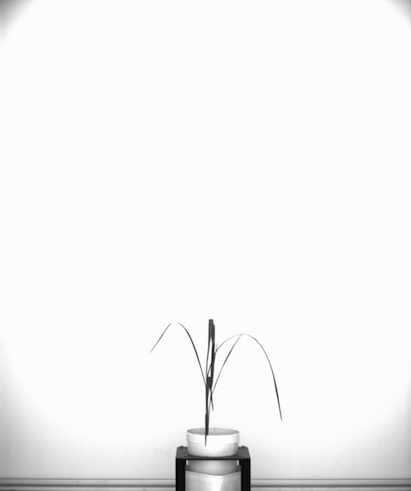
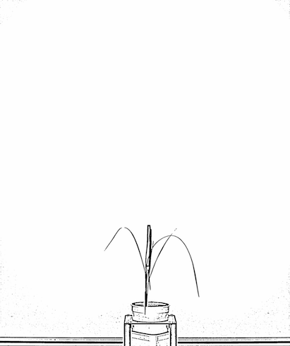
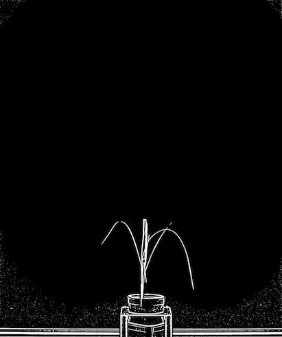
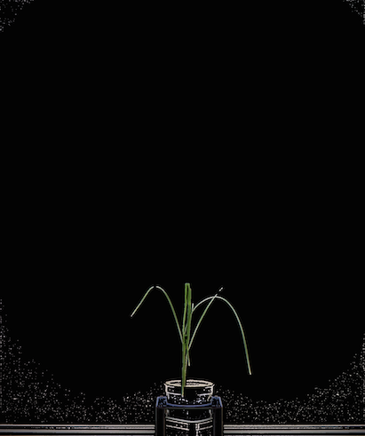
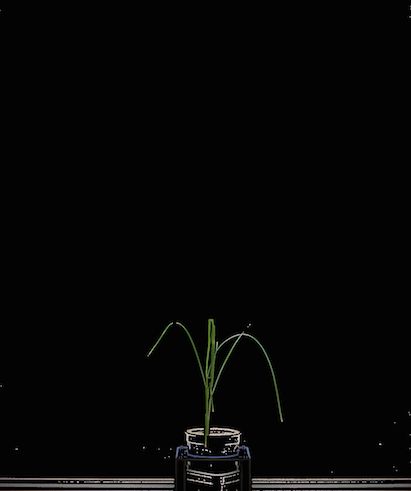
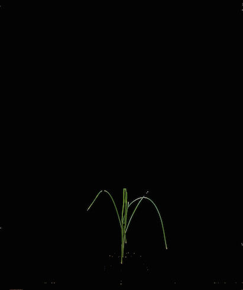
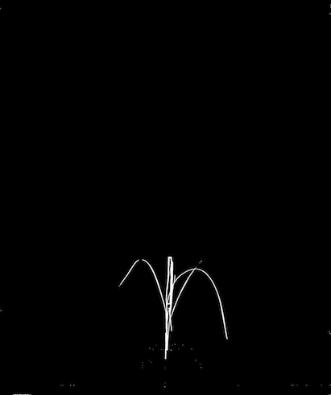

Core Processing Example #2
===========================
This section will go over a longer script that provides details on many different image processing
functions including blurring, thresholding, morphologies, color filtering, and contour cutting, as
well as many core functions, such as save, restore, show, and write.

Python Script
-----------------------
:download:`Download Script <../../examples/scripts/core2/core2.txt>`

:download:`Download Image <../../examples/scripts/core2/base.png>`

.. code-block:: python

	import ih.imgproc
	plant = ih.imgproc.Image("/path/to/your/image")

	plant.save("base")
	plant.show("base")

	plant.convertColor("bgr", "gray")
	plant.show("grayscale")

	plant.gaussianBlur((5, 5))
	plant.show("blur")

	plant.adaptiveThreshold(255, "mean", "binary", 15, 3)
	plant.show("adaptive threshold")

	plant.bitwise_not()
	plant.show("invert")

	plant.convertColor("gray", "bgr")
	plant.bitwise_and("base")
	plant.show("recolor")

	plant.morphology("open", "rect", (3, 3))
	plant.show("morph")

	plant.colorFilter("(((max - min) > 40) and ((b - g) < 30))", [plant.y - 350, -1, -1, -1])
	plant.show("filter")
	plant.save("filter")

	plant.convertColor("bgr", "gray")
	plant.threshold(0)
	plant.save("binary")
	plant.restore("filter")

	plant.contourCut("binary", basemin = 500, resize = True)
	plant.show("final")
	plant.write("final.png")

	print "total plant pixels = ",plant.extractPixels()
	print "[plant height, plant width] = ",plant.extractDimensions()
	print "Nonzero color data -- [ [bmean, bmed], [gmean, gmed], [rmean, rmed] ] = ",plant.extractColorData()
	print "With zero color data -- [ [bmean, bmed], [gmean, gmed], [rmean, rmed] ] = ",plant.extractColorData(nonzero = False)

	plant.wait()

This script show cases several features of ih, is fairly simple and fairly accurate.  Let's talk about it block by block:

.. code-block:: python

	import ih.imgproc
	plant = ih.imgproc.Image("/path/to/your/image")

These two lines setup your image.  The first line imports the actual library to be used, and in this case we
want the imgproc module from ih.  The second line creates an object of your image, named 'plant'.  Our image
has been loaded in, so we are ready for processing.

.. code-block:: python

	plant.save("base")
	plant.show("base")

These two lines don't do any actual processing yet.  The :py:meth:`~ih.imgproc.Image.save` method saves what our image currently looks like
for future use.  This will be used in a later step to re-constitute the color of the image.  We fed in the name
'base', and that's how we will refer to this saved image in the future.  The 'show' method simply opens a window
of the current image.  Show automatically resizes an image down if it is too large (which it will be).  We also
fed in the name base which means our window will have the title 'base'.  If a name is not fed in, the titles
will simply be numbered.  Here's what our base image looks like:

For viewing purposes all images have been greatly reduced in size.  On to the next block:

.. code-block:: python

	plant.convertColor("bgr", "gray")
	plant.show("grayscale")

Now we do some actual processing!  The :py:meth:`~ih.imgproc.Image.convertColor` method does exactly that -- changes the spectrum of the image.
Currently, supported spectrums are "bgr", "hsv", "lab", "ycrcb", and "gray".  It is important to remember that
many spectrum changes are one-directional.  In this case, we convert "bgr" to "gray", giving us a grayscale image.
If we then called the same function in reverse i.e. plant.convertColor("gray", "bgr"), our image would look exactly the same.
You can find more information on this in the :py:meth:`~ih.imgproc.Image.convertColor` method.  Again, we use
'show' to view the result of our step.  Here's what our gray scale image looks like:

|

.. code-block:: python

	plant.gaussianBlur((5, 5))
	plant.show("blur")

Here we blur the image slightly, using :py:meth:`~ih.imgproc.Image.gaussianBlur` with a kernel of size 5 x 5.
The first number specifies the height of the kernel, and the second the width of the kernel.  Blurring an image
before thresholding will help smooth the result, and remove more noise from the image.  Here's our result:

|

.. code-block:: python

	plant.adaptiveThreshold(255, "mean", "binary", 15, 3)
	plant.show("adaptive threshold")

Next, we threshold our gray image.  Normal thresholding (see the :py:meth:`~ih.imgproc.Image.threshold` method) simply
checks to see if each pixel in the image is greater than the specified threshold.  The :py:meth:`~ih.imgproc.Image.adaptiveThreshold` method
breaks up the image into windows, and considers each window separately.  '255' represents the value we assign to a pixel if it beats the
threshold.  "mean" is the adaptive method we use -- we take the average of the pixels in a window to determine the threshold.
"binary" is the threshold type.  15 is the window size -- which means we consider 15 x 15 blocks of pixels as each window.  3
is a constant that is subtracted from the calculated threshold for each window.  Again, we use 'show' to view the result of our step.
Here's what our image looks like after adaptive thresholding:

|

.. code-block:: python

	plant.bitwise_not()
	plant.show("inverted")

The :py:meth:`~ih.imgproc.Image.bitwise_not` method inverts an image.  If the image is a color image it processes each channel separately.
Inverting the image is going to be important for our next step.  Here's the inverted image:

|

.. code-block:: python

	plant.convertColor("gray", "bgr")
	plant.bitwise_and("base")
	plant.show("recolor")

This step recolors the image to the original colors which we saved under the name 'base'.  :py:meth:`~ih.imgproc.Image.bitwise_and`
computes the logical and of two images.  This function can only be used on two images of the same shape.  In this case, our base
image has 3 channels, an r, g, and b channel, but our gray image only has 1 channel, intensity.  Even though :py:meth:`~ih.imgproc.Image.convertColor`
won't change what the image looks like, we need to ensure that both images have the same number of channels before computing the bitwise_and.
This extra convertColor step doesn't need to happen when using command-line scripts for processing, because images are saved and loaded as
3 channel images.  Here's the recolored image:

We've stripped a lot of the background out of image with pretty good accuracy.
We need to clean up the noise around the bottom, and clean up the pot still.

.. code-block:: python

	plant.morphology("open", "rect", (3, 3))
	plant.show("morph")

:py:meth:`~ih.imgproc.Image.morphology` uses one of several different methods to adjust the structure of your image.
In this case, we use morphological opening -- this erodes all borders in the image, and then adds borders back on to
the shapes still in the image.  In this case, it removes a lot of the noise around the bottom without hurting the
plant very much:

Now we need to filter out the carrier, as well as the track from the bottom of the image.

.. code-block:: python

	plant.colorFilter("(((max - min) > 40) and ((b - g) < 30))", [plant.y - 350, -1, -1, -1])
	plant.show("filter")
	plant.save("filter")

:py:meth:`~ih.imgproc.Image.colorFilter` is a powerful method that takes 2 arguments, the first is logic, the second is a region of interest.
The logic argument to colorFilter must be well formed based on symbolic logic rules.  This means that operators can only act on two operands,
which means that your logic string may have more parenthesis than if it were in a standard language.  You can find more information under the
:py:meth:`~ih.imgproc.Image.colorFilter` docs.  Based on our logic, we only keep a pixel if it meets both of the following conditions:
the maximum value of the pixel (max([r, g, b])) minus the minimum value of the pixel (min([r, g, b])) is greater than 40, and the blue value
of the pixel minus the green value of the pixel is less than 30.  The first condition removes all gray pixels.  Gray colors have lower variance between
the three channels and we target them likewise.  This piece will filter out the track and the bright colors of the pot.  The second condition will remove
the blue part of the part.  The next argument is our region of interest.  All roi's have the following form [ystart, yend, xstart, xend], due to the order
which opencv uses.  Additionally, -1 can be used as a placeholder for any value in an roi, and represents the far edge for that value.  For start values
-1 is equivalent to 0, for end values -1 is equivalent to the maximal width or height of the image.  Finally,
the plant object internally maintains a width as 'x' and a height as 'y'.  plant.x will return the plant's width, and plant.y will return the
plant's height.  So, in this case our region of interest targets only the bottom 350 pixels of the image.  ystart is at plant.y - 350, and we use the maximal
height of the image for yend.  We also target the entire width of the plant -- we use -1 for both xstart and xend.  Here's the image after filtration:

At this point we will call our image processing good, and crop the image down to just the plant, so we can get an accurate height and width.
To do this, we will use the :py:meth:`~ih.imgproc.Image.contourCut` function.  This function requires a color image, and a binary image.
We have saved our current image under the name 'filter', so we need to prepare a binary image:

.. code-block:: python

	plant.convertColor("bgr", "gray")
	plant.threshold(0)
	plant.save("binary")
	plant.restore("filter")

We can't threshold color images, so we begin by using :py:meth:`~ih.imgproc.Image.convertColor` to convert our image to gray scale.  Next, we
use :py:meth:`~ih.imgproc.Image.threshold` with a thresh value of 0 to threshold our image.  With a threshold of 0, as long as any pixel is
non-zero, it will be kept.  This means that we will create a binary image that is an exact structural replica of our current image.  We save
this image for later use under the name 'binary'.  Final, we :py:meth:`~ih.imgproc.Image.restore~ our color image we previously saved.
The restore method changes the current image to a previously saved one. Here's what our binary image looks like:

|

.. code-block:: python

	plant.contourCut("binary", basemin = 500, resize = True)
	plant.show("final")
	plant.write("final.png")

Finally, we use :py:meth:`~ih.imgproc.Image.contourCut` to crop our image.  contourCut removes pieces of an
image based on the size of contours, which are clusters of pixels in the image.  Noise in the image is spread
out in small clusters, but the plant is connected.  Specifying a sufficiently large threshold value will cause
the noise to get excluded from the image.  The final roi of the image is determined by the contours that are
larger than the threshold value, and the image is cropped such that all the contours remain in the image.  The
image calculates contours from the binary image, but returns a final image based on the colors of the current image.
We feed in 'binary' as our binary image, specify a threshold area of 500 pixels, and specify resize = True.  If resize
is false, the image won't be resized, and instead, all pixels outside the roi will be set off.  We :py:meth:`~ih.imgproc.Image.write`
our final image to "final.png".  By default, images are written to the current directory, unless you specify an outputdir when
you create the plant object. Here's the final, un-scaled image:

.. image:: ../../examples/scripts/core2/final.png
	:align: center

Now that our image is processed, we extract data from it:

.. code-block:: python

	print "total plant pixels = ",plant.extractPixels()
	print "[plant height, plant width] = ",plant.extractDimensions()
	print "Nonzero color data -- [ [bmean, bmed], [gmean, gmed], [rmean, rmed] ] = ",plant.extractColorData()
	print "With zero color data -- [ [bmean, bmed], [gmean, gmed], [rmean, rmed] ] = ",plant.extractColorData(nonzero = False)

Each of these lines print out information about our final image.  :py:meth:`~ih.imgproc.Image.extractPixels` returns the
total number of non-zero pixels in the image.  :py:meth:`~ih.imgproc.Image.extractDimensions` returns the height and
width of the plant.  :py:meth:`~ih.imgproc.Image.extractColorData` calculates histograms for each individual color channel
of the image, and returns the median and mean for each histogram.  By default, it only uses non-zero values in its calculations,
but you can specify nonzero = False to use all values.  Your output should look something like this:

.. code-block:: python

	total plant pixels =  21964
	[plant height, plant width] =  [637, 668]
	Nonzero color data -- [ [bmean, bmed], [gmean, gmed], [rmean, rmed] ] =  [[56.514124293785308, 11.0], [71.787162162162161, 34.5], [67.78235294117647, 25.0]]
	With zero color data -- [ [bmean, bmed], [gmean, gmed], [rmean, rmed] ] =  [[35.67578125, 10.0], [53.78515625, 9.0], [44.4140625, 9.0]]

Finally, hiding at the end is the following line:

.. code-block:: python

	plant.wait()

The :py:meth:`~ih.imgproc.Image.wait` does exactly that, and is a wrapper to 2 opencv functions.  First, the function
will pause execution, and all of the images you displayed will stay open in the named windows you specified.  Second,
while focused on one of your displayed windows, if you press any key, it will remove all the windows, and continue execution
of the program -- which in this case means the program will stop.

Command Line Script
-------------------
:download:`Download Script <../../examples/scripts/core2/core2.sh>`

:download:`Download Image <../../examples/scripts/core2/base.png>` (The image is identical to the one above)

.. code-block:: bash

	#!/bin/bash

	ih-convert-color --input "/path/to/your/image" --output "gray.png" --intype "bgr" --outtype "gray"
	ih-gaussian-blur --input "gray.png" --output "blur.png" --kwidth 5 --kheight 5
	ih-adaptive-threshold --input "blur.png" --output "thresh.png" --value 255 --adaptiveType "mean" --thresholdType "binary" --blockSize 15 --C 3
	ih-bitwise-not --input "thresh.png" --output "invert.png"
	ih-bitwise-and --input1 "base.png" --input2 "invert.png" --output "recolor.png"
	ih-morphology --input "recolor.png" --output "morph.png" --morphType "open" --ktype "rect" --kwidth 3 --kheight 3
	ih-color-filter --input "morph.png" --output "filter.png" --logic "(((max - min) > 40) and ((b - g) < 30))" --ystart "y - 350"
	ih-threshold --input "filter.png" --output "binary.png" --thresh 0
	ih-contour-cut --input "filter.png" --binary "binary.png" --output "final.png" --basemin 500 --resize

This bash script should perform the exact same workflow as the one above.  Although not major, it is important to note the
differences between library and command line access.  Command line access loads and writes an image at each step,
whereas library access loads once, and only writes when you tell it to.  Additionally, script names are close to that
of the method, and all follow lower case format, with words separated by dashes, and ih pre-pendening all commands.
Most arguments are the same, but because we can't specify tuples or lists from the command line, arguments like kernels and
regions of interest have to change.  Individual arguments are defined, as you can see in gaussian-blur, morphology, and
color-fitler.  kwidth and kheight have to specified individual, and ystart, yend, xstart, xend have to be specified individual.
-1 is assumed as the default value for roi, so any value you don't specify will be the edge for that position as specified
above.  For the contour-cut 'resize' argument, you don't have to specify true, as simply adding --resize will imply
you want to resize the image.
