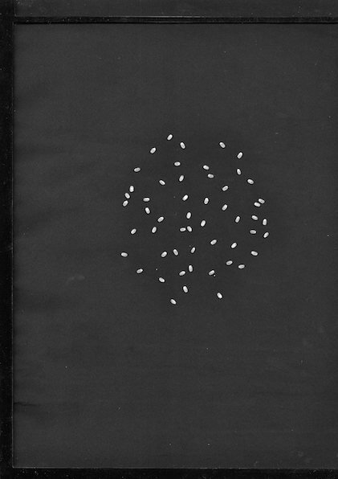
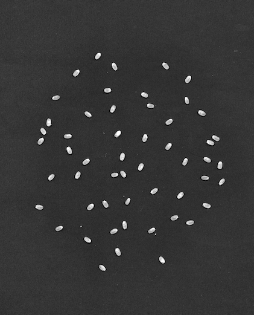
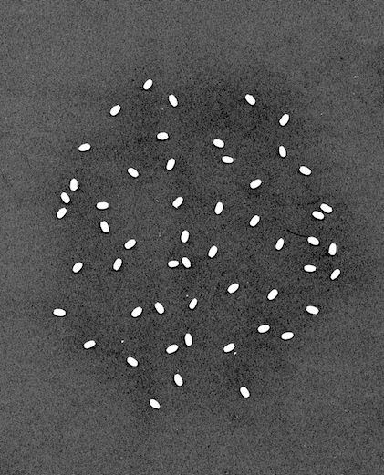
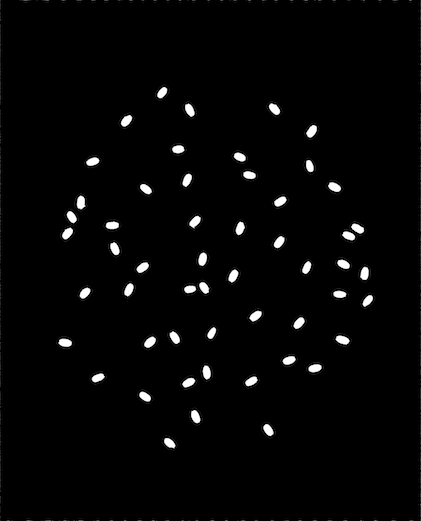
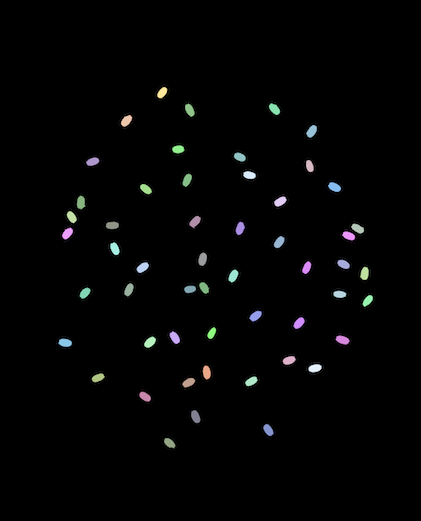

Seed Processing Example
===========================
This section details a script used for analyzing seed scans.  This script, ih-seed,
comes included with the ih installation, and can be used to extract basic
metrics from a seed scan image.  In this example we will process the following
image:

From this image we will get a seed count, as well as individual length, width,
and area metrics for each seed.

:download:`Download Image <../../examples/scripts/seed/seed.jpg>`

:download:`Download Results <../../examples/scripts/seed/results.csv>`

If IH is installed you should be able to run this script simply
by typing ih-seed at the command line.  You can print out all options
for the script by executing ih-seed -h.  Your results should look something like this:

.. code-block:: bash

  usage: ih-seed [-h] --input INPUT --output OUTPUT [--dpi DPI] [--roi ROI]
                 [--ystart YSTART] [--yend YEND] [--xstart XSTART] [--xend XEND]
                 [--writesteps]

  Processes & Extracts a seed scan.

  optional arguments:
    -h, --help       show this help message and exit
    --input INPUT    Path to input seed scan image.
    --output OUTPUT  Path to output csv file.
    --dpi DPI        dpi of the image.
    --roi ROI        roi file
    --ystart YSTART  Minimum Y of the roi.
    --yend YEND      Maximum Y of the roi.
    --xstart XSTART  Minimum X of the roi.
    --xend XEND      Maximum X of the roi.
    --writesteps     If specified, write processing steps.

The only arguments that really need to be talked about are the roi arguments.
You can pass in an roi as a json file with the --roi argument, or by specifying
individual bounds with the --ystart, --yend, --xstart, --xend arguments (for
more information see the ROI section on the image processing page).  The passed
in roi only needs to be small enough to remove white edges around the outside
of the image, but the smaller the cropped image is the faster the processing will run.
Here's the full example arguments used to process the above image:

.. code-block:: bash

  ih-seed --input seed.jpg --output results.csv --ystart 2000 --yend "y - 3000" --xstart 2000 --xend "x - 1000" --writesteps

If you haven't yet, go ahead and download the sample image (:download:`Download Image <../../examples/scripts/seed/seed.jpg>`)
and run the above command on it.  Once it finishes you should end with 5 additional files.
A results.csv file containing information about each seed, and 4 image files
corresponding to the processing steps.  First the image should be cropped
based on the region specified, down to just the seeds:

Then, the seeds are thresholded using otsu's method:

Finally, contours in the image are removed based on their size.  This lets
us keep the seeds since they are large and connected, while removing all
the background noise:

The last image generated is an image for confirming that the contours are
calculated correctly.  A random color is assigned to each contour that
way it is easy to identify that seeds are being treated individually,
and are not grouped together.

|
